# MCP Fintech Platform Architecture Diagram

```mermaid
graph TB
    %% Main Sections
    subgraph "End Users"
        Browser["Web Browser"]
        MobileApp["Mobile App (Future)"]
    end

    subgraph "Frontend (Next.js)"
        NextJS["Next.js Application"]
        
        subgraph "Frontend Components"
            Pages["Pages (File-based Routing)"]
            Components["Reusable Components"]
            Hooks["Custom React Hooks"]
            StateManagement["State Management<br>(Zustand/Redux)"]
            APIClient["API Client<br>(React Query)"]
            SSEClient["SSE Client<br>(EventSource)"]
        end
        
        subgraph "Frontend Technologies"
            TypeScript["TypeScript"]
            TailwindCSS["Tailwind CSS"]
            ReactFramework["React 18+"]
            NextAuth["NextAuth.js"]
            StoryBook["Storybook"]
        end
    end

    subgraph "Backend (Python)"
        FastAPI["FastAPI Application"]
        
        subgraph "MCP Server"
            FastMCP["FastMCP Server"]
            
            subgraph "MCP Components"
                Resources["MCP Resources"]
                Tools["MCP Tools"]
                SSETransport["SSE Transport"]
                Notifications["Notification System"]
            end
            
            subgraph "Core Modules"
                AuthModule["Authentication Module"]
                BankingModule["Banking Module<br>(Plaid Integration)"]
                PaymentModule["Payment Module<br>(Stripe Integration)"]
                InvestmentModule["Investment Module<br>(Alpaca Integration)"]
                FraudModule["Fraud Detection Module"]
                AdminModule["Admin Module"]
                DeveloperModule["Developer Portal Module"]
            end
        end
        
        subgraph "Backend Technologies"
            Python["Python 3.9+"]
            Pydantic["Pydantic"]
            SQLAlchemy["SQLAlchemy ORM"]
            Alembic["Alembic Migrations"]
            JWT["JWT Authentication"]
            SAML["SAML/OAuth Integration"]
        end
    end

    subgraph "Data Layer"
        PostgreSQL["PostgreSQL Database"]
        Redis["Redis Cache"]
        S3["AWS S3<br>(Document Storage)"]
    end

    subgraph "Third-Party Services"
        Plaid["Plaid API<br>(Banking)"]
        Stripe["Stripe API<br>(Payments)"]
        Alpaca["Alpaca API<br>(Investments)"]
        Auth0["Auth0/Okta<br>(Optional SSO)"]
    end

    subgraph "Cloud Deployment (AWS)"
        subgraph "Compute"
            ECS["Amazon ECS<br>(Container Orchestration)"]
            EC2["Amazon EC2<br>(Application Servers)"]
            Lambda["AWS Lambda<br>(Serverless Functions)"]
        end
        
        subgraph "Networking"
            ALB["Application Load Balancer"]
            CloudFront["CloudFront CDN"]
            Route53["Route 53 DNS"]
            WAF["AWS WAF<br>(Web Application Firewall)"]
        end
        
        subgraph "Database Services"
            RDS["Amazon RDS<br>(PostgreSQL)"]
            ElastiCache["ElastiCache<br>(Redis)"]
        end
        
        subgraph "Storage"
            S3Bucket["S3 Buckets"]
        end
        
        subgraph "Security"
            IAM["IAM Roles & Policies"]
            KMS["KMS Encryption"]
            Secrets["Secrets Manager"]
            SecurityGroups["Security Groups"]
        end
        
        subgraph "Monitoring"
            CloudWatch["CloudWatch"]
            XRay["X-Ray"]
        end
    end

    subgraph "CI/CD Pipeline"
        subgraph "Version Control"
            GitHub["GitHub Repository"]
        end
        
        subgraph "CI/CD Tools"
            GitHubActions["GitHub Actions"]
            DockerBuild["Docker Build"]
            ECR["Amazon ECR<br>(Container Registry)"]
        end
        
        subgraph "Deployment Environments"
            Dev["Development"]
            Staging["Staging"]
            Production["Production"]
        end
        
        subgraph "Infrastructure as Code"
            Terraform["Terraform"]
            CloudFormation["CloudFormation"]
        end
    end

    subgraph "Automated Testing"
        subgraph "Testing Types"
            UnitTests["Unit Tests"]
            IntegrationTests["Integration Tests"]
            E2ETests["End-to-End Tests"]
            ContractTests["API Contract Tests"]
            PerformanceTests["Performance Tests"]
            SecurityTests["Security Tests"]
        end
        
        subgraph "Testing Tools"
            Pytest["Pytest"]
            Jest["Jest"]
            Cypress["Cypress"]
            Postman["Postman/Newman"]
            K6["k6 Load Testing"]
            OWASP["OWASP ZAP"]
            MCPInspector["MCP Inspector"]
        end
        
        subgraph "Test Automation"
            TestRunner["Test Runners"]
            TestReporting["Test Reporting"]
            CodeCoverage["Code Coverage"]
        end
    end

    subgraph "Monitoring & Observability"
        Prometheus["Prometheus"]
        Grafana["Grafana Dashboards"]
        ELK["ELK Stack<br>(Elasticsearch, Logstash, Kibana)"]
        Sentry["Sentry<br>(Error Tracking)"]
        DataDog["DataDog<br>(APM)"]
    end

    %% Connections
    Browser --> NextJS
    MobileApp --> FastAPI
    
    %% Frontend Connections
    NextJS --> Pages
    NextJS --> Components
    NextJS --> Hooks
    NextJS --> StateManagement
    NextJS --> APIClient
    NextJS --> SSEClient
    
    Pages --> TypeScript
    Components --> TypeScript
    Components --> TailwindCSS
    Components --> ReactFramework
    Components --> StoryBook
    Hooks --> TypeScript
    StateManagement --> TypeScript
    APIClient --> TypeScript
    SSEClient --> TypeScript
    
    APIClient --> FastAPI
    SSEClient --> SSETransport
    NextJS --> NextAuth
    
    %% Backend Connections
    FastAPI --> FastMCP
    FastMCP --> Resources
    FastMCP --> Tools
    FastMCP --> SSETransport
    FastMCP --> Notifications
    
    FastMCP --> AuthModule
    FastMCP --> BankingModule
    FastMCP --> PaymentModule
    FastMCP --> InvestmentModule
    FastMCP --> FraudModule
    FastMCP --> AdminModule
    FastMCP --> DeveloperModule
    
    AuthModule --> Python
    BankingModule --> Python
    PaymentModule --> Python
    InvestmentModule --> Python
    FraudModule --> Python
    AdminModule --> Python
    DeveloperModule --> Python
    
    FastAPI --> Pydantic
    FastAPI --> SQLAlchemy
    SQLAlchemy --> Alembic
    AuthModule --> JWT
    AuthModule --> SAML
    
    %% Data Layer Connections
    SQLAlchemy --> PostgreSQL
    AuthModule --> Redis
    FastMCP --> Redis
    AdminModule --> S3
    
    %% Third-Party Service Connections
    BankingModule --> Plaid
    PaymentModule --> Stripe
    InvestmentModule --> Alpaca
    AuthModule --> Auth0
    
    %% Cloud Deployment Connections
    NextJS --> CloudFront
    FastAPI --> ALB
    ALB --> ECS
    ECS --> EC2
    FraudModule --> Lambda
    
    CloudFront --> Route53
    ALB --> Route53
    CloudFront --> WAF
    ALB --> WAF
    
    PostgreSQL --> RDS
    Redis --> ElastiCache
    S3 --> S3Bucket
    
    ECS --> IAM
    Lambda --> IAM
    RDS --> IAM
    S3Bucket --> IAM
    
    FastAPI --> Secrets
    NextJS --> Secrets
    RDS --> KMS
    S3Bucket --> KMS
    Secrets --> KMS
    
    ECS --> SecurityGroups
    RDS --> SecurityGroups
    ElastiCache --> SecurityGroups
    
    ECS --> CloudWatch
    Lambda --> CloudWatch
    RDS --> CloudWatch
    FastAPI --> XRay
    
    %% CI/CD Pipeline Connections
    GitHub --> GitHubActions
    GitHubActions --> DockerBuild
    DockerBuild --> ECR
    ECR --> ECS
    
    GitHubActions --> Dev
    GitHubActions --> Staging
    GitHubActions --> Production
    
    Dev --> Terraform
    Staging --> Terraform
    Production --> Terraform
    Terraform --> CloudFormation
    
    %% Testing Connections
    GitHubActions --> UnitTests
    GitHubActions --> IntegrationTests
    GitHubActions --> E2ETests
    GitHubActions --> ContractTests
    GitHubActions --> PerformanceTests
    GitHubActions --> SecurityTests
    
    UnitTests --> Pytest
    UnitTests --> Jest
    IntegrationTests --> Pytest
    IntegrationTests --> Jest
    E2ETests --> Cypress
    ContractTests --> Postman
    PerformanceTests --> K6
    SecurityTests --> OWASP
    Resources --> MCPInspector
    Tools --> MCPInspector
    
    Pytest --> TestRunner
    Jest --> TestRunner
    Cypress --> TestRunner
    TestRunner --> TestReporting
    TestRunner --> CodeCoverage
    
    %% Monitoring Connections
    ECS --> Prometheus
    Lambda --> Prometheus
    RDS --> Prometheus
    ElastiCache --> Prometheus
    Prometheus --> Grafana
    
    FastAPI --> ELK
    NextJS --> ELK
    ECS --> ELK
    Lambda --> ELK
    
    FastAPI --> Sentry
    NextJS --> Sentry
    
    FastAPI --> DataDog
    NextJS --> DataDog
    ECS --> DataDog
    RDS --> DataDog
```

## Architecture Flow Description

### User Interaction Flow

1. **End Users** access the application through web browsers or mobile apps (future)
2. **Frontend (Next.js)** serves the user interface, handling:
   - Page rendering and routing
   - Component management
   - State management
   - API communication
   - Real-time updates via SSE

### Data Flow

1. **Frontend to Backend**:
   - API requests from React Query to FastAPI endpoints
   - Real-time connections via SSE Client to SSE Transport
   - Authentication via NextAuth.js to JWT/SAML

2. **Backend Processing**:
   - FastAPI routes requests to appropriate MCP components
   - MCP Server (FastMCP) handles:
     - Resources (banking, payments, investments)
     - Tools (operations, actions)
     - Notifications (real-time updates)
   - Core modules process business logic

3. **Data Storage**:
   - PostgreSQL for relational data (via SQLAlchemy)
   - Redis for caching and session management
   - S3 for document storage

4. **Third-Party Integrations**:
   - Plaid for banking connections
   - Stripe for payment processing
   - Alpaca for investment operations
   - Auth0/Okta for SSO (optional)

### Deployment Flow

1. **CI/CD Pipeline**:
   - Code committed to GitHub
   - GitHub Actions triggers automated workflows
   - Docker images built and pushed to ECR
   - Terraform applies infrastructure changes
   - Deployment to appropriate environment (Dev/Staging/Production)

2. **Cloud Infrastructure (AWS)**:
   - Frontend served via CloudFront CDN
   - Backend runs on ECS/EC2 containers
   - Serverless functions on Lambda
   - Load balancing via ALB
   - Database services (RDS, ElastiCache)
   - Security (WAF, IAM, KMS, Security Groups)

### Testing Flow

1. **Automated Testing**:
   - Unit tests with Pytest (backend) and Jest (frontend)
   - Integration tests for API and component interactions
   - End-to-End tests with Cypress
   - API contract tests with Postman/Newman
   - Performance tests with k6
   - Security tests with OWASP ZAP
   - MCP compliance tests with MCP Inspector

2. **Test Automation**:
   - Tests run in CI/CD pipeline
   - Test reporting and dashboards
   - Code coverage tracking

### Monitoring Flow

1. **Observability**:
   - Metrics collection with Prometheus
   - Visualization with Grafana
   - Logging with ELK Stack
   - Error tracking with Sentry
   - Application performance monitoring with DataDog

## Technology Stack Summary

### Frontend
- **Framework**: Next.js, React 18+
- **Language**: TypeScript
- **Styling**: Tailwind CSS
- **State Management**: Zustand/Redux
- **API Client**: React Query
- **Real-time**: EventSource (SSE)
- **Authentication**: NextAuth.js
- **Documentation**: Storybook

### Backend
- **Framework**: FastAPI, FastMCP
- **Language**: Python 3.9+
- **Data Validation**: Pydantic
- **ORM**: SQLAlchemy
- **Migrations**: Alembic
- **Authentication**: JWT, SAML/OAuth
- **Real-time**: Server-Sent Events (SSE)

### Data Storage
- **Relational Database**: PostgreSQL (Amazon RDS)
- **Caching**: Redis (ElastiCache)
- **Object Storage**: AWS S3

### Third-Party Services
- **Banking**: Plaid API
- **Payments**: Stripe API
- **Investments**: Alpaca API
- **Identity**: Auth0/Okta (optional)

### Cloud Infrastructure (AWS)
- **Compute**: ECS, EC2, Lambda
- **Networking**: ALB, CloudFront, Route53, WAF
- **Database**: RDS, ElastiCache
- **Storage**: S3
- **Security**: IAM, KMS, Secrets Manager, Security Groups
- **Monitoring**: CloudWatch, X-Ray

### CI/CD
- **Version Control**: GitHub
- **CI/CD**: GitHub Actions
- **Containerization**: Docker, ECR
- **IaC**: Terraform, CloudFormation
- **Environments**: Development, Staging, Production

### Testing
- **Backend Testing**: Pytest
- **Frontend Testing**: Jest
- **E2E Testing**: Cypress
- **API Testing**: Postman/Newman
- **Performance Testing**: k6
- **Security Testing**: OWASP ZAP
- **MCP Testing**: MCP Inspector

### Monitoring
- **Metrics**: Prometheus
- **Dashboards**: Grafana
- **Logging**: ELK Stack (Elasticsearch, Logstash, Kibana)
- **Error Tracking**: Sentry
- **APM**: DataDog
